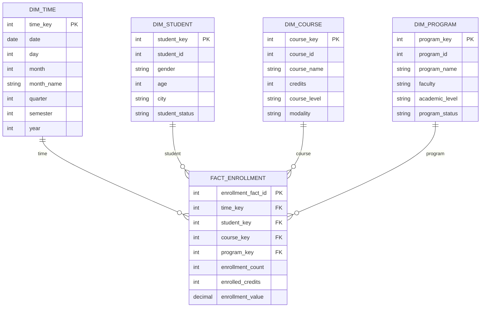

# Corte 1 — Diseño de un Modelo Estrella

## 1. Proceso de negocio

El proceso de negocio seleccionado es la **matrícula de estudiantes en cursos universitarios**.

Una universidad registra cada semestre las matrículas realizadas por los estudiantes en diferentes cursos y programas académicos. Esta información permite analizar el comportamiento de las matrículas, identificar los cursos con mayor demanda y apoyar la planeación académica.

### Pregunta de negocio

**¿Cuántas matrículas se realizan por programa académico, curso y período académico?**

Esta pregunta permite identificar qué programas y cursos presentan una mayor o menor demanda.

### KPI

**KPI: Número total de matrículas por período académico.**

**Fórmula:**

```text
Total de matrículas = COUNT(enrollment_id)
```

**Meta:**

Alcanzar al menos **1.000 matrículas por período académico**.

El seguimiento de este KPI permite evaluar la demanda académica y apoyar decisiones relacionadas con la apertura de cursos, asignación de profesores y disponibilidad de grupos.

---

## 2. Sistema de origen: OLTP

El sistema donde se registran las matrículas funciona como un sistema **OLTP (Online Transaction Processing)**.

Este sistema está diseñado para realizar operaciones transaccionales como:

* Registrar estudiantes.
* Registrar programas académicos.
* Crear cursos.
* Registrar una matrícula.
* Modificar el estado de una matrícula.
* Consultar información específica de un estudiante.

El sistema OLTP debe responder rápidamente a operaciones individuales y normalmente utiliza una base de datos normalizada para evitar redundancia de información.

Sin embargo, realizar análisis históricos directamente sobre esta base de datos puede generar consultas complejas y afectar el rendimiento del sistema transaccional.

Por esta razón, la información debe ser enviada a un **Data Warehouse con enfoque OLAP (Online Analytical Processing)**.

El entorno OLAP permite analizar grandes cantidades de información histórica desde diferentes perspectivas, por ejemplo:

* Matrículas por año.
* Matrículas por semestre.
* Matrículas por programa.
* Matrículas por curso.
* Matrículas por estudiante.

Esto permite realizar consultas analíticas sin afectar las operaciones diarias del sistema OLTP.

---

# 3. Modelo estrella

El modelo estrella tendrá como centro la tabla de hechos:

**FACT_ENROLLMENT**

Cada registro de esta tabla representa **una matrícula realizada por un estudiante en un curso**.

## Tabla de hechos — FACT_ENROLLMENT

| Campo              | Descripción                         |
| ------------------ | ----------------------------------- |
| enrollment_fact_id | Identificador del registro          |
| time_key           | Llave hacia la dimensión Tiempo     |
| student_key        | Llave hacia la dimensión Estudiante |
| course_key         | Llave hacia la dimensión Curso      |
| program_key        | Llave hacia la dimensión Programa   |
| enrollment_count   | Cantidad de matrículas              |
| enrolled_credits   | Número de créditos matriculados     |
| enrollment_value   | Valor económico de la matrícula     |

### Medidas

Las principales medidas del modelo son:

* **Enrollment Count:** permite contar el número total de matrículas.
* **Enrolled Credits:** permite calcular la cantidad total de créditos matriculados.
* **Enrollment Value:** permite calcular el valor económico generado por las matrículas.

Para cada matrícula:

```text
enrollment_count = 1
```

De esta manera se puede utilizar:

```text
SUM(enrollment_count)
```

para conocer el total de matrículas.

---

# 4. Dimensiones

## DIM_TIME

Permite analizar las matrículas de acuerdo con diferentes períodos de tiempo.

| Campo      | Descripción             |
| ---------- | ----------------------- |
| time_key   | Identificador de tiempo |
| date       | Fecha completa          |
| day        | Día                     |
| month      | Mes                     |
| month_name | Nombre del mes          |
| quarter    | Trimestre               |
| semester   | Semestre académico      |
| year       | Año                     |

---

## DIM_STUDENT

Contiene información relacionada con los estudiantes.

| Campo          | Descripción                   |
| -------------- | ----------------------------- |
| student_key    | Identificador de la dimensión |
| student_id     | Identificador del estudiante  |
| gender         | Género                        |
| age            | Edad                          |
| city           | Ciudad                        |
| student_status | Estado del estudiante         |

---

## DIM_COURSE

Contiene información relacionada con los cursos ofrecidos por la universidad.

| Campo        | Descripción                   |
| ------------ | ----------------------------- |
| course_key   | Identificador de la dimensión |
| course_id    | Identificador del curso       |
| course_name  | Nombre del curso              |
| credits      | Número de créditos            |
| course_level | Nivel del curso               |
| modality     | Modalidad del curso           |

---

## DIM_PROGRAM

Contiene información de los programas académicos.

| Campo          | Descripción                   |
| -------------- | ----------------------------- |
| program_key    | Identificador de la dimensión |
| program_id     | Identificador del programa    |
| program_name   | Nombre del programa           |
| faculty        | Facultad                      |
| academic_level | Nivel académico               |
| program_status | Estado del programa           |

---

# 5. Diagrama del modelo estrella



El modelo tiene la tabla **FACT_ENROLLMENT** en el centro y las dimensiones alrededor de ella, formando una estructura de modelo estrella.

---

# 6. Preguntas que puede responder el modelo

### Pregunta 1

**¿Cuántas matrículas se realizaron por programa académico y semestre?**

Para responder esta pregunta se pueden utilizar:

* FACT_ENROLLMENT
* DIM_PROGRAM
* DIM_TIME

Medida:

```text
SUM(enrollment_count)
```

---

### Pregunta 2

**¿Cuáles son los cursos con mayor número de estudiantes matriculados cada año?**

Para responder esta pregunta se pueden utilizar:

* FACT_ENROLLMENT
* DIM_COURSE
* DIM_TIME

Medida:

```text
SUM(enrollment_count)
```

Esto permite identificar los cursos con mayor demanda y apoyar la planeación de grupos y profesores.

---

# Model & questions

The star schema is designed to analyze the university enrollment process. The central fact table is **FACT_ENROLLMENT**, where each record represents one student enrollment in a course. Its main measures are **enrollment count, enrolled credits, and enrollment value**. The model includes the **Time, Student, Course, and Program** dimensions, which allow the data to be analyzed from different perspectives. One business question that the model can answer is: **How many enrollments are registered by academic program and semester?** Another business question is: **Which courses have the highest number of enrolled students each year?** This model can help the university understand enrollment trends and improve academic planning.
